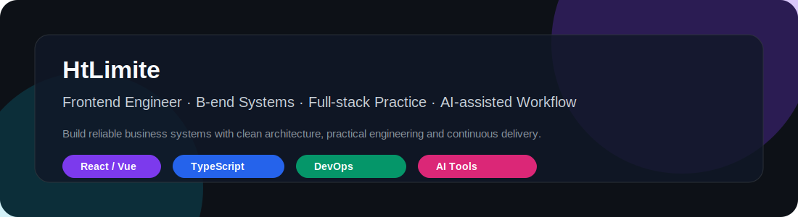
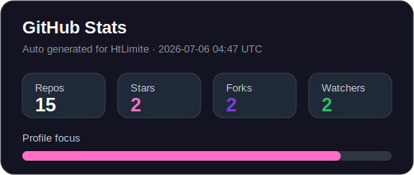
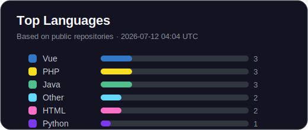
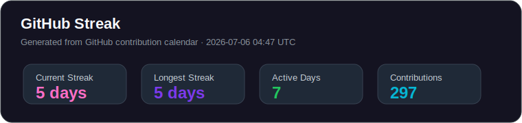
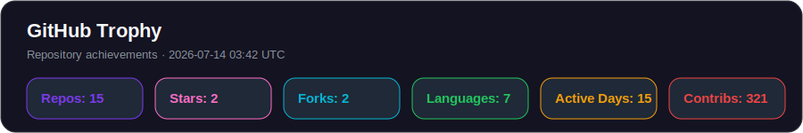
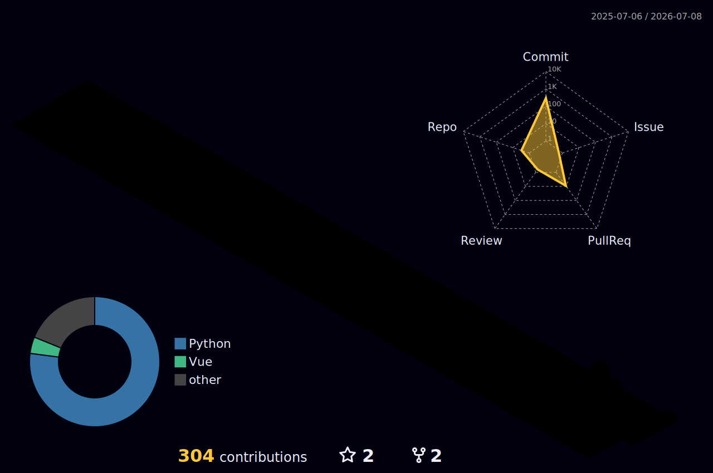

<!-- Profile README for HtLimite -->

<p align="center">
  
</p>

<h1 align="center">Hi, I'm HtLimite 👋</h1>

<p align="center">
  <b>前端工程师 · B 端业务系统 · 全栈实践 · AI 辅助研发</b><br />
  <sub>Frontend Engineer · B-end Systems · Full-stack Practice · AI-assisted Development</sub>
</p>

<p align="center">
  <a href="https://github.com/HtLimite"></a>
  <a href="https://wyy.hair"></a>
</p>

<p align="center">
  
  
  
  
  
</p>

<p align="center">
  
</p>

---

## 01 · 能力全景 / Visual Expertise

<table>
  <tr>
    <td align="center" width="33%">
      <h3>🎨 Frontend Engineering</h3>
      <p>React · Vue · TypeScript · Umi · Vite</p>
      
    </td>
    <td align="center" width="33%">
      <h3>🏢 B-end Systems</h3>
      <p>复杂表格 · 表单 · 权限 · 流程 · 导入导出</p>
      
    </td>
    <td align="center" width="33%">
      <h3>🚀 Full-stack Delivery</h3>
      <p>Spring Boot · Node.js · MySQL · Redis · Docker</p>
      
    </td>
  </tr>
  <tr>
    <td align="center" width="33%">
      <h3>🧰 DevOps Workflow</h3>
      <p>Nginx · Jenkins · Linux · CI/CD · 自动化部署</p>
      
    </td>
    <td align="center" width="33%">
      <h3>🤖 AI-assisted Work</h3>
      <p>Coding Agent · CLI Workflow · Debugging · Docs</p>
      
    </td>
    <td align="center" width="33%">
      <h3>🧩 Product Thinking</h3>
      <p>稳定 · 清晰 · 可维护 · 可交付</p>
      
    </td>
  </tr>
</table>

---

## 02 · 工程流程 / Engineering Workflow

<p align="center">
  
  
  
  
  
  
</p>

```txt
需求理解 → 方案拆解 → 组件开发 → 联调优化 → 部署上线 → 自动化提效
```

---

## 03 · 项目展示 / Project Showcase

<table>
  <tr>
    <td width="50%" valign="top">
      <h3><a href="https://github.com/HtLimite/housekeep-admin-vue">🏢 housekeep-admin-vue</a></h3>
      <p><b>B 端管理后台前端项目</b></p>
      <p>面向业务管理场景，关注复杂列表、搜索筛选、表单、权限控制和后台页面组织。</p>
      <p>
        
        
        
      </p>
      <p><a href="https://github.com/HtLimite/housekeep-admin-vue"></a></p>
    </td>
    <td width="50%" valign="top">
      <h3><a href="https://github.com/HtLimite/housekeep-api">⚙️ housekeep-api</a></h3>
      <p><b>后端 API 与业务服务层</b></p>
      <p>用于承载业务接口、数据处理和服务层逻辑，适合作为前后端联调与全栈实践入口。</p>
      <p>
        
        
        
      </p>
      <p><a href="https://github.com/HtLimite/housekeep-api"></a></p>
    </td>
  </tr>
  <tr>
    <td width="50%" valign="top">
      <h3><a href="https://github.com/HtLimite/credit">💳 credit</a></h3>
      <p><b>Node.js 全栈项目实践</b></p>
      <p>用于沉淀 Node.js、接口、页面和全栈业务开发能力。</p>
      <p>
        
        
        
      </p>
      <p><a href="https://github.com/HtLimite/credit"></a></p>
    </td>
    <td width="50%" valign="top">
      <h3><a href="https://github.com/HtLimite/ai-gemini-report">🤖 ai-gemini-report</a></h3>
      <p><b>AI / Gemini 相关实践</b></p>
      <p>记录 AI 工具、报告生成、智能化工作流和自动化提效相关探索。</p>
      <p>
        
        
        
      </p>
      <p><a href="https://github.com/HtLimite/ai-gemini-report"></a></p>
    </td>
  </tr>
  <tr>
    <td width="50%" valign="top">
      <h3><a href="https://github.com/HtLimite/HtLimite.github.io">🌐 HtLimite.github.io</a></h3>
      <p><b>个人站点 / 技术博客</b></p>
      <p>用于展示个人站点、技术记录、项目沉淀和长期学习内容。</p>
      <p>
        
        
      </p>
      <p><a href="https://github.com/HtLimite/HtLimite.github.io"></a></p>
    </td>
    <td width="50%" valign="top">
      <h3><a href="https://github.com/HtLimite/library">📚 library</a></h3>
      <p><b>代码、工具与学习资料沉淀</b></p>
      <p>用于收集常用代码片段、工具资料、学习笔记和长期积累内容。</p>
      <p>
        
        
        
      </p>
      <p><a href="https://github.com/HtLimite/library"></a></p>
    </td>
  </tr>
</table>

<p align="center">
  <a href="https://github.com/HtLimite/housekeep-foundations"></a>
  <a href="https://github.com/HtLimite/housekeep-customer"></a>
  <a href="https://github.com/HtLimite/Vue"></a>
</p>

---

## 04 · 技术栈 / Tech Stack

<p align="center">
  
</p>

<p align="center">
  
  
  
  
  
  
  
  
  
  
  
  
  
</p>

---

## 05 · GitHub 数据面板 / GitHub Dashboard

<table>
  <tr>
    <td width="50%"></td>
    <td width="50%"></td>
  </tr>
</table>

<p align="center">
  
</p>

<p align="center">
  
</p>

---

## 06 · 贡献活动 / Contribution Zone

<p align="center">
  
</p>

<p align="center">
  
</p>

<p align="center">
  <picture>
    <source media="(prefers-color-scheme: dark)" srcset="./assets/github-contribution-grid-snake-dark.svg" />
    <source media="(prefers-color-scheme: light)" srcset="./assets/github-contribution-grid-snake.svg" />
    
  </picture>
</p>

---

## 07 · 当前关注 / Current Focus

<p align="center">
  
  
  
  
  
</p>

---

## 08 · 工程原则 / Principles

<table>
  <tr>
    <td align="center" width="25%">
      <h3>🎯 业务优先</h3>
      <p>技术不是为了炫技，而是为了把真实业务问题稳定落地。</p>
    </td>
    <td align="center" width="25%">
      <h3>🛡️ 稳定交付</h3>
      <p>优先保证页面稳定、数据可靠、异常可控、流程清晰。</p>
    </td>
    <td align="center" width="25%">
      <h3>🧩 可维护性</h3>
      <p>关注组件抽象、模块边界、接口封装和长期可读性。</p>
    </td>
    <td align="center" width="25%">
      <h3>🚀 持续提效</h3>
      <p>用工程化、自动化和 AI 工具提升开发、排错和交付效率。</p>
    </td>
  </tr>
</table>

<p align="center">
  
  
  
  
</p>

---

## 09 · 联系与入口 / Contact

<table>
  <tr>
    <td align="center" width="33%">
      <h3>🐙 GitHub</h3>
      <p>项目、代码、学习沉淀</p>
      <a href="https://github.com/HtLimite"></a>
    </td>
    <td align="center" width="33%">
      <h3>🌐 Blog</h3>
      <p>技术记录、实践总结、工具研究</p>
      <a href="https://wyy.hair"></a>
    </td>
    <td align="center" width="33%">
      <h3>🤖 AI Workflow</h3>
      <p>AI 编程、CLI 工作流、自动化提效</p>
      
    </td>
  </tr>
</table>

<p align="center">
  <b>持续学习 · 稳定交付 · 用工程化方式把复杂业务做清楚</b><br />
  <sub>Keep learning. Keep shipping. Build reliable systems.</sub>
</p>
