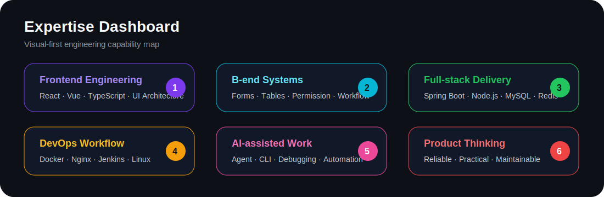
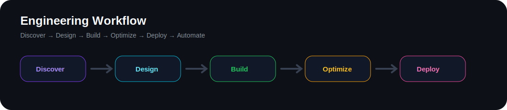
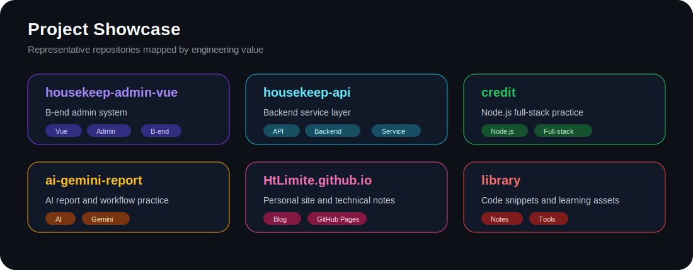
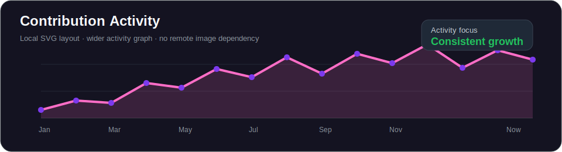

<!-- Profile README for HtLimite -->

  

<h1 align="center">Hi, I'm HtLimite 👋</h1>

  <b>Frontend Engineer · B-end Systems · Full-stack Practice · AI-assisted Development</b>

  
  

  
  
  
  
  

  

---

## 01 · Visual Expertise

  

---

## 02 · Engineering Workflow

  

---

## 03 · Project Showcase

  

  
  
  
  

---

## 04 · Tech Stack

  

  
  
  
  
  
  
  
  
  
  
  
  
  

---

## 05 · GitHub Dashboard

<table>
  <tr>
    <td width="50%"></td>
    <td width="50%"></td>
  </tr>
</table>

  

  

---

## 06 · Contribution Zone

  

  

  

---

## 07 · Current Focus

  
  
  
  
  

---

## 08 · Principles

  
  
  
  

---

## 09 · Contact

  
  

  <b>Keep learning. Keep shipping. Build reliable systems.</b>

